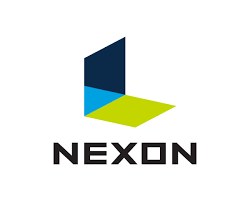

<h1 align="center">🕹️ Windows API를 활용한 점프킹 모작 포트폴리오</h1>

   Windows API를 사용해 2D 게임 개발 기술을 습득하는 것을 목표로 했습니다.  
   "점프킹"의 핵심 메커니즘인 점프와 충돌 같은 게임의 기본이 되는 기술을 습득하기에 적합하다고 판단해 선정했습니다.

 

## :star: 하이라이트

| 프로젝트 환경  | 액션 시스템 |
|-----------------|-------------|
|  |  |
| UI 오버레이 사용자 인터페이스 | 힐 딜러와 보스의 AI 연계 |
|  |  |

 

## 🔗 링크
- [포트폴리오 영상](https://youtu.be/eDX4UGlbLdY)

 

## ▶ 프로필
- **이름**: `[2D 개인 프로젝트] Windows API – 점프킹(모작)`
- **기간**: `2023.08.08 ~ 2023.08.22`
- **인원**: `1명`
- **역할**: `엔진`, `클라이언트`
- **장르**: `3D`, `오픈월드`
- **플랫폼**: `PC`

 

## ⚙️ 개발 환경
- **개발 언어**: `C`, `C++`
- **개발 툴**: `Visual Studio 2022` 
- **렌더링 API**: `Windows API`

 

## 🎯 목적
- 해당 작업을 통해 DirectX 11과 GPU 프로그래밍을 프로젝트에 적용해보았습니다.
- 전투 시스템 UI, AI 연계, 액션 동작을 게임 엔진에서 구현하였습니다.
- 2개의 모드로 분리된 보스 전투 시스템의 디테일을 완성했습니다.

 

## 🛠️ 구현 사항
- **DirectX11**을 구현하여 충돌 처리, 데이터베이스 디스크 로드를 계획하고 AI 개체 행동 패턴을 조정했습니다.
- **상호작용 시스템**: 플레이어가 특정 이벤트에서 상호작용할 수 있도록 액션을 관리하였습니다.
- **최적화 작업**: 렌더링 최적화 및 게임 메모리 사용을 개선해 안정적인 프레임을 유지했습니다.
